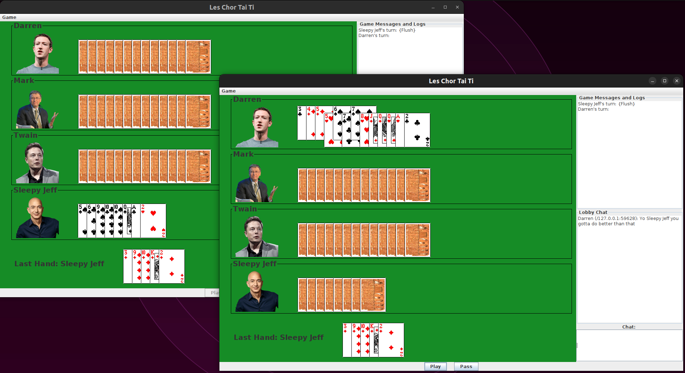

# Big Two

## Installation and Usage
1. Clone this repository
2. `cd` to the cloned repository
3. `javac *.java`
4. `java BigTwoServer`
5. Create 4 terminal tabs and run `java BigTwo` in each of them, or get friends.
6. Enjoy!
